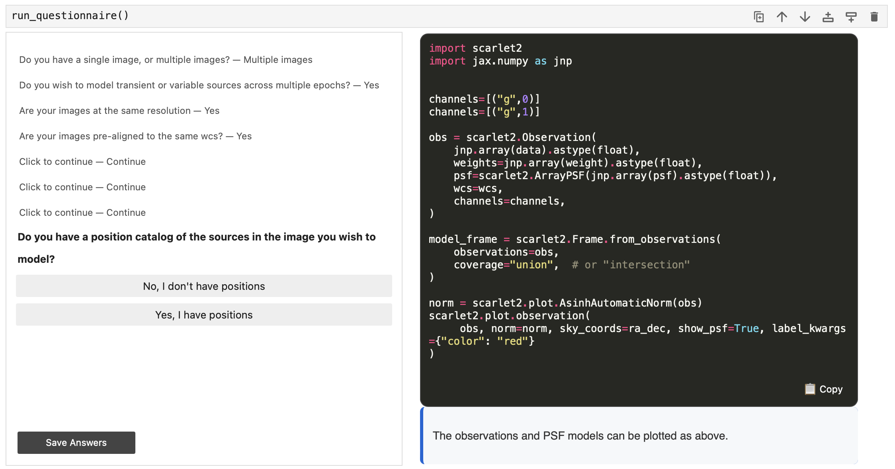

# Questionnaire

## User Guide - Interactive Project Setup

The scarlet2 questionnaire is an interactive tool designed to help you quickly set up a new scarlet2 project 
by generating a customized code template that matches your use case.

### Running the Questionnaire

To run the questionnaire, you need to import and call the `run_questionnaire` function from the `scarlet2.questionnaire` module:

```python
from scarlet2.questionnaire import run_questionnaire
run_questionnaire()
```



This will launch an interactive widget in your Jupyter notebook that guides you through a series of questions about your project and your data.

The questionnaire presents one question at a time with multiple-choice answers. For each answer you select, 
the questionnaire will update the code template to match your choices and display some explanatory text to 
help you understand the code being generated.

### Using the Generated Template

As you progress through the questionnaire, a code template is dynamically generated based on your answers.
The code will outline the steps needed to set up your scarlet2 project, but it will require some manual editing
to fill in specific details about your data. For example, the code will include definitions of example values 
for variables like `channels` that you will need to replace with values that match your data, and will 
reference variables like `data` and `psf` that you will need to change to use your actual data.

In the bottom right of the code output, you can click the "📋 Copy" button at any time to copy the generated 
code to your clipboard.

> Note: The template is a starting point that you can modify to fit your specific data. It provides the structure for your project based on your use case.

## Developer Guide - Questionnaire Architecture

The questionnaire module is designed to be extensible and maintainable. This section explains how the questionnaire works internally and how to modify or extend it.

### Module Structure

The questionnaire module consists of several key components:

1. **questions.yaml**: Stores the actual questions, answers, and templates
2. **models.py**: Defines the data structures used by the questionnaire that map to the YAML file
3. **questionnaire.py**: Contains the main `QuestionnaireWidget` class that uses ipywidgets to render the UI and handle user interactions

### YAML Structure

Setting up the questions in the questionnaire is done by modifying the `questions.yaml` file. 
The questions are defined in this YAML file with the following structure:

```yaml
initial_template: "{{code}}"  # The starting template with placeholders
initial_commentary: "Welcome message"  # (Optional) The initial commentary text before any questions are answered
questions:  # List of top-level questions
  - question: "Question text" # Each question object has a question text, answers, and optionally a variable
    variable: "variable_name"  # Optional variable to store the answer to be referenced later
    answers:
      - answer: "Answer option 1" # Each answer has an answer text
        tooltip: "Helpful tooltip" # Optional tooltip for the answer that appears on hover of the button
        templates:  # A list of code snippets to apply if selected
          - replacement: code  # The placeholder to replace
            code: "# Your code here\n{{next_placeholder}}"  # The replacement code
        commentary: "Explanation of this choice" # The commentary text to display when this answer is selected, can include markdown formatting
        followups:  # Additional questions to ask immediately if this answer is selected. This list of followups matches the structure of top-level questions, and can include question objects or switch/case objects
          - question: "Follow-up question"
            answers: [...]
  - question: "..." # More questions
    answers: [...]
  # ...
  - switch: "variable_name"  # Conditional branching based on a previous answer
    cases:
      - value: 0  # If the question with variable "variable_name" was answered with the first answer (index 0)
        questions: [...] # The questions to ask in this case. This list matches the structure of top-level questions, and can include question objects or switch/case objects
      - value: null  # The default case if no other case matches or if the variable was not set (e.g. the question was skipped) If there is no default case, the switch is skipped
        questions: [...]
```

The questionnaire starts with an `initial_template` that contains placeholders (e.g. `{{code}}`) that will be replaced
as the user answers questions. Each question has a list of possible answers, and each answer can specify one or more
code snippets to replace the specified placeholders in the template, as well as commentary text to display. 
The commentary can include markdown formatting which will be rendered in the commentary box.
Answers can also specify follow-up questions that are asked immediately after the current question if that answer is selected.

The flow of questions can also include conditional branching using `switch` objects that check the value of a 
previously answered question (by its variable name) and present different sets of questions based on the answer.

> Note: In YAML, single and double quotes behave differently. Single quotes will treat backslashes as literal 
> characters, while double quotes will interpret backslashes as escape characters. For example, to include a 
> newline character in a string, you would use double quotes: `"Line 1\nLine 2"`. If you used single quotes, 
> it would be treated as the literal text `Line 1\nLine 2` without a newline.

The yaml file is packaged with the module as it is built, and is loaded using the `importlib.resources` module
that allows access to package data files even in a zipped package. With `pyproject.toml` and `setuptools-scm`,
any package data files that are tracked by git are automatically included in the package, and so the
`questions.yaml` file is included automatically when the package is built and deployed.
[(See the setuptools documentation for more details).](https://setuptools.pypa.io/en/latest/userguide/datafiles.html).

### Data Models

The questionnaire uses Pydantic models to define its data structures which are found in `models.py`. 
These models match the structure of the YAML file and are used to parse and validate the questionnaire data
loaded from the YAML file.

Pydantic allows defining dataclasses with type hints and validation, making it easier to work with structured 
data like the questionnaire configuration. When the YAML file is loaded, it is parsed into these models for 
use in the questionnaire logic. If the YAML structure does not match the expected models, Pydantic will raise 
validation errors when the questionnaire is initialized.

### QuestionnaireWidget Class

The `QuestionnaireWidget` class is responsible for rendering the questionnaire UI and handling user interactions.

It uses `ipywidgets` to render the questionnaire in the output of a jupyter cell. The class maintains the 
state of the questionnaire, including the current question, the user's answers, and the generated code template.

The state consists of:

- `self.code_output`: The current code template with placeholders. This is updated as the user answers questions. Regex is used to find and replace placeholders in the template when updating with answer templates.
- `self.commentary`: The current commentary text that explains the generated code. This is set with each answer.
- `self.questions_stack`: A stack of questions to ask. This allows for handling follow-up questions and branching logic. The next question is popped from the stack when needed.
- `self.question_answers`: A list of tuples of (question, answer_index) representing the user's answers to each question. This is used to display the history of questions and answers in the UI.
- `self.variables`: A dictionary mapping variable names to the index of the selected answer. This is used for switch/case branching.

The UI consists of a question area with a list of the previous questions and answers and a set of buttons 
for the current question's answers, and an output area that displays the generated code template and 
commentary text.

The question area uses ipywidgets components to display the questions and answer buttons, and handle the user
input. The output area uses a HTML widget to display the generated code with syntax highlighting, the copy
button, and the commentary text. Since the output area is written in HTML, the code defining the output area
is stored in separate HTML template files (`output_box.html.jinja` and `output_box.css`) for easier editing.
These template files are also included in the package using `setuptools-scm` the same way as `questions.yaml`.
The `jinja2` templating engine is used to render the HTML with the generated code and commentary. For syntax
highlighting, the `pygments` library is used to convert the code into HTML with appropriate styling, and the
commentary text is converted from markdown to HTML using the `markdown` library.

Key methods include:
- `_get_next_question()`: Determines the next question to display. A stack is used to manage the flow of questions, including handling follow-up questions and switch/case branching.
- `_handle_answer()`: Processes user answers and updates the state.
- `_update_template()`: Applies template changes based on answers.
- `_render_output_box()`: Creates the UI for displaying the generated code. Uses Jinja2, pygments, and markdown for rendering.
